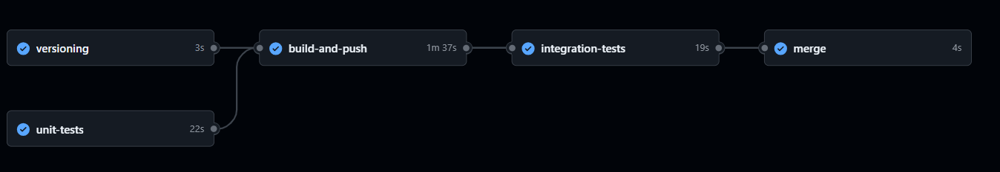

#  Prévision de séries temporelles météorologiques pour la ville de Londre 

## Description du projet

Ce projet implémente un pipeline MLOps complet pour la prévision de la température à Londres sur un horizon de **3 jours** avec un **pas de temps de 3 heures** (8 prédictions par jour, soit 24 valeurs au total).

Les données proviennent de l'API [Open-Meteo](https://open-meteo.com/) qui fournit des températures historiques issues de modèles de réanalyse. La ville choisie pour la prédiction est la ville de **Londres**. La série brute (pas horaire) est agrégée en pas de 3 heures : la valeur à 00h est la moyenne des valeurs mesurées à 00h, 01h et 02h, etc.

Trois approches ont été comparées :
- une Baseline naïve** qui fait la répétition de la dernière valeur connue
- Un TCN multi_output qui prédit les 24 points en sortie 
- Un LSTM multi-output qui prédit les 24 points en sortie 

Le modèle retenu est le LSTM multi_output


## Architecture et flux de données

```
┌──────────────────────────────────────────────────────┐
│                    ENTRAÎNEMENT                      │
│                                                      │
│  Open-Meteo API                                      │
│       │                                              │
│       ▼                                              │
│  src/data/        ← acquisition et agrégation 3h    │
│       │                                              │
│       ▼                                              │
│  data/weather.db  ← stockage SQLite                  │
│       │                                              │
│       ▼                                              │
│  src/training/    ← preprocessing, entraînement      │
│       │                                              │
│       ▼                                              │
│  MLflow (mlruns/) ← runs, métriques, artefacts       │
│       │                                              │
│       ▼                                              │
│  models/lstm_multi.keras ← modèle champion           │
└──────────────────────────────────────────────────────┘

┌──────────────────────────────────────────────────────┐
│                  INFÉRENCE (BATCH)                   │
│                                                      │
│  src/inference/run_inference.py                      │
│       │  charge les 24 derniers points (lookback)    │
│       │  génère 24 prédictions (horizon 3 jours)     │
│       ▼                                              │
│  data/weather.db  ← table predictions                │
└──────────────────────────────────────────────────────┘

┌──────────────────────────────────────────────────────┐
│                      SERVING                         │
│                                                      │
│  api/main.py (FastAPI)                               │
│       ├── GET /predictions                           │
│       │        ← prédictions filtrées                │
│       ├── GET /predictions/combined                  │
│       │        ← prédictions et températures réelles │
│       └── GET /version                               │
│                ← version logicielle et modèle        │
└──────────────────────────────────────────────────────┘

┌──────────────────────────────────────────────────────┐
│                     MONITORING                       │
│                                                      │
│  Prometheus ← scrape /metrics toutes les 15s         │
│       │       (latence, requêtes par endpoint...)    │
│       ▼                                              │
│  Grafana    ← dashboards de visualisation            │
└──────────────────────────────────────────────────────┘
```

## Structure du projet

```
.
├── .github/
│   └── workflows/
│       └── cicd.yml         # Pipeline CI/CD
├── api/
│   ├── main.py              # Endpoints FastAPI
│   └── schemas.py           # Modèles de validation Pydantic
├── data/
│   ├── weather.db           # Base SQLite

├── models/
│   ├── lstm_multi.keras     # Modèle  sérialisé
│   └── scaler.pkl           # Scaler MinMax sérialisé
├── monitoring/
│   ├── prometheus.yml
│   ├── app_streamlit.py     # Dashboad streamlit pour visualiser les prédictions
│   ├── output/              # Graphiques affichants les métriques d'évaluation (RMSE, MAE) apres inférence 
│   └── grafana/
│       └── provisioning/
│           ├── datasources/
│           └── dashboards/
├── notebooks/
│   ├──classification_images.ipynb           # Notebook de classification des images  
│   ├──Classification_multimodale.ipynb      # Notebook de classification multimodale
│   ├──classification_textes.ipynb           # Notebook de classification des textes
│   ├──EDA_données multimodales.ipynb        # Analyse exploratoire complète pour la classification multimodale
│   ├──Prévision_séries_temporelles.ipynb    # Notebook prévision de séries temporelles
│   ├──util_fusion.py                        # fonctions utilitaires pour la classification multimodale  
│   ├──util_image.py                         # fonctions utilitaires pour la classification des images
│   ├──util_text.py                          # fonctions utilitaires pour la classification des textes
│   └──util_ts.py                            # fonctions utilitaires pour le notebook de  la prévision de séries temporelles
├── requirements/
│   ├── monitoring.txt       # Dépendances pour le monitoring avec grafana et prometheus
│   ├── serving.txt          # Dépendances pour l'image docker contenant l'api
│   ├── streamlit.txt        # Dépendances pour l'image docker contenant l'application streamlit
│   ├── test.txt             # Dépendances pour les tests
│   └── training.txt         # Dépendances pour le module training 
├── src/
│   ├── common/
│   │   └── common.py        # Variables globales (CONFIG, ROOT_DIR)
│   ├── data/
|   │   ├── database.py      # création, manipulation de la base SQLite
│   │   └── download_data.py # acquisition des données depuis l'api Meteo
│   ├── inference/
|   │   ├── get_run.py       # récupération de la dernière version du modèle dans /mlruns
│   │   └── run_inference.py # Inférence par batch (prédiction de 24 points)
│   ├── test/
│   │   ├── integration/     # Tests d'intégration
│   │   └── unit/            # Tests unitaires
│   ├── training/
│   │   ├── train.py         #  entraînement du modèle
│   │   └── preprocessing.py #  Récupération et préprocessing des données 
│   └── monitoring/
│   │   └── generate_plot.py # Graphique prédictions vs observé
│   ├── main.py              # script principal ( aquisition de données - preprocessing- entrainement- inference)


├── config.yml               # Configuration centralisée
...

---

```

### Configuration

Le fichier `config.yml` centralise tous les paramètres ( url de téléchargement, paramètres mlflow, etc) qui sont chargés par src/common/common.py.


### Workflow d'entraînement

Le workflow d'entraînement se décompose en 4 étapes :

**1. Acquisition des données**
- Téléchargement des températures horaires depuis l'API Open-Meteo pour Londres (2019–2024)
- Stockage des données dans SQLite (`data/weather.db`, table `weather_data`)

**2. Prétraitement**
- Agrégation en pas de 3 heures : chaque valeur est la moyenne de 3 heures consécutives
- Nettoyage de la série 
- Normalisation avec `MinMaxScaler` sur la feature température
- Construction des séquences `lookback=24` (24 points de contexte) et `horizon=24` (24 points de prévision)
- Découpage temporel  en train / validation / test
- Sauvegarde du scaler dans `models/scaler.pkl`

**3. Entraînement du modèle**
- Validation croisée avec `TimeSeriesSplit` sur `n_splits=4` folds 
- Pour chaque fold : entraînement d'un LSTM temporaire avec  prédiction sur le fold de validation
- Entraînement du modèle final sur l'ensemble du train


**4. Inférence batch**
- Chargement des `24` dernières observations depuis `weather_data`
- Génération de `24` prédictions 
- Sauvegarde dans la table `predictions` de SQLite 

**5. Récupération des valeurs réelles**
- Récupération des valeurs réelles pour les dernères prédictions 
- Stockage dans la base de données SQlite


Pour lancer l'execution du pipeline :
```bash
python -m  src/main                

```

Les artefacts d'entrainement avec MLflow sont stockés dans `/mlruns`

En local, lancez ```bash mlflow ui ``` pour accéder à l'interface mlflow et visualiser les runs.

**Note :** Le pipeline d'entraînement et l'inférence  sont exécutés localement et indépendamment du déploiement. Ils ne sont pas inclus dans l'image Docker ni orchestrés via Docker Compose.


### Lancer l'API avec Docker Compose

* Récuperer la dernière version des images de serving et de streamlit:

```bash
docker compose pull
```
* Lancer les services :

```bash
docker compose up
```

Services disponibles :
* **API       → http://localhost:8000**
* **Streamlit → http://localhost:8501**
* **Prometheus→ http://localhost:9090**
* **Grafana   → http://localhost:3000**


La documentation interactive de l'api est disponible sur `http://localhost:8000/docs`.
### Endpoints

| Méthode | Endpoint | Description |
|---|---|---|
| `GET` | `/predictions` | Prédictions filtrées par date et/ou modèle |
| `GET` | `/predictions/combined` | Prédictions et  observations réelles sur une période |
| `GET` | `/version` | Version logicielle (0.0.0 en local, SHA en CI) et version modèle |
| `GET` | `/metrics` | Métriques Prometheus |

---

## Pipeline CI/CD

Le pipeline GitHub Actions est défini dans `.github/workflows/cicd.yml`. Il s'exécute à chaque push sur `dev`.

### architecture et dépendance des Jobs




**`versioning`** — génère un identifiant de version à partir du SHA court du commit Git.

**`unit-tests`** — installe les dépendances , exécute `pytest src/test/unit/` avec  Python 3.13.

**`build-and-push`** — checkout du code au SHA exact, build du stage `serving` du Dockerfile multi-stage, push sur GHCR avec deux tags : la version précise  et `latest`. Dépend de `versioning` et de `unit-tests`

**`integration-tests`** — démarre le container de l'image fraîchement buildée, attend que l'API soit disponible, puis exécute `pytest src/test/integration/`.

**`merge`** — merge la version stable du code sur la branche main.


---


## Monitoring

### Prometheus + Grafana

Les Métriques exposées automatiquement sur `/metrics` via `prometheus-fastapi-instrumentator` :

- Nombre de requêtes par endpoint (`http_requests_total`)
- Latence  (`http_request_duration_seconds`)
- Compteur de prédictions générées (`predictions_total`)

Le dashboard Grafana est provisionné automatiquement au démarrage depuis `monitoring/grafana/provisioning/`.

### Monitoring des erreurs de prédiction

Le script `src/monitoring/generate_plot.py` génère un graphique comparant les prédictions aux observations réelles une fois celles-ci disponibles, sauvegardé dans `monitoring/output/`.


